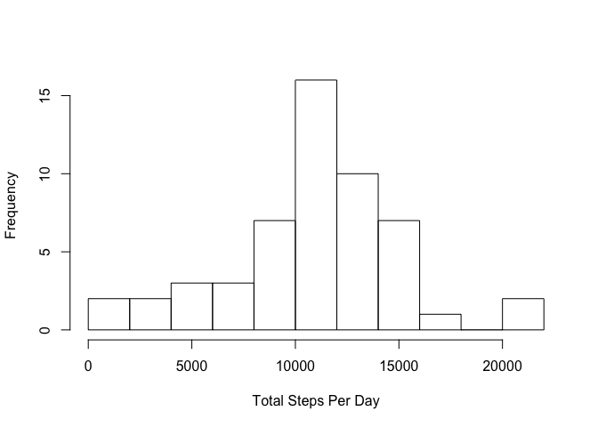
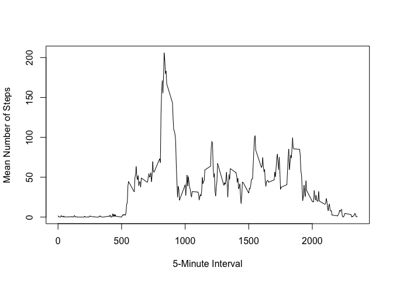
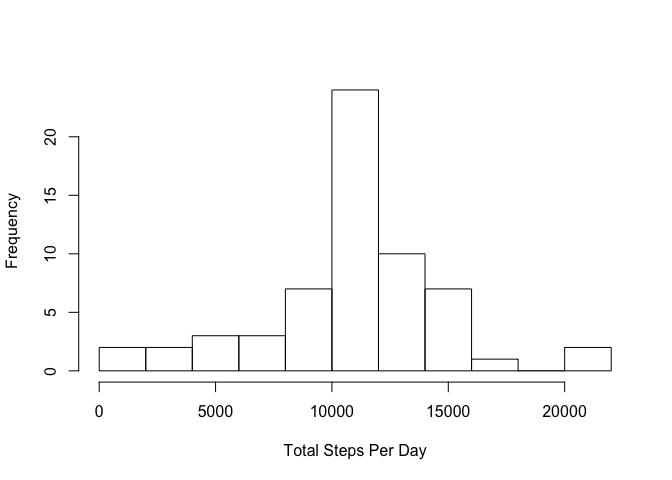
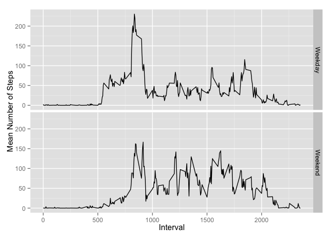

# Reproducible Research: Peer Assessment 1


## Loading and Preprocessing Data

First, we import libraries, and load the dataset.

```r
library(ggplot2)
df_raw <- read.csv('activity.csv')
```

## What is the mean total number of steps taken per day?

We then aggregate data to get total numbers of steps per day, then plot the histogram of number of steps taken per day (before imputing any values). Finally, compute the mean and median total number of steps per day.

```r
sumStepsPerDay <- aggregate(. ~ date, data = df_raw, FUN = sum)
hist(sumStepsPerDay$steps, breaks=10, xlab = "Total Steps Per Day", main = NULL)
```

 

```r
meanStepsPerDay <- mean(sumStepsPerDay$steps)
medianStepsPerDay <- median(sumStepsPerDay$steps)
meanStepsPerDay
```

```
## [1] 10766.19
```

```r
medianStepsPerDay
```

```
## [1] 10765
```

The distribution approximates a normal distribution. It can be seen from the above that the mean number of steps per day is 10766 and the median number of steps per day is 10765.

## What is the average daily activity pattern?

To get average (mean) number of steps per 5-minute interval across days, we aggregate on the "interval" variable. Then, we generate the time-series plot. Finally, get the time interval for which the maximum number of steps occurs.


```r
meanStepsPerInterval <- aggregate(. ~ interval, data = df_raw, FUN = mean)
plot(meanStepsPerInterval$interval, meanStepsPerInterval$steps, type = "l", xlab = "5-Minute Interval", ylab = "Mean Number of Steps")
```

 

```r
maxSteps <- meanStepsPerInterval[which.max(meanStepsPerInterval$steps),]
maxSteps
```

```
##     interval    steps     date
## 104      835 206.1698 30.71698
```

It can be seen from the above that the interval with the value of 835 has the max mean number of steps across all the days. Presumably this is the interval from 8:35am to 8:40am.

## Impute missing values

Calculate the total number of missing values.

```r
numberNA <- sum(is.na(df_raw$steps))
numberNA
```

```
## [1] 2304
```
The total number of missing values is therefore 2304.

Replace any missing values with the mean value for its time interval, after first creating a copy of the original data frame. (Visiting each row, if row has an NA value, use its interval to find the corresponding mean number of steps from the "meanStepsPerInterval" data frame computed above.)

```r
#NARows <- df_raw[which(is.na(df_raw$steps)),]
df_imputed <- df_raw
for (i in 1:dim(df_imputed)[1]) {
        if (is.na(df_imputed[i, 1])) {
                ind <- which(meanStepsPerInterval$interval==df_imputed[i, 3])
                df_imputed[i, 1] <- meanStepsPerInterval[ind, 2]
        }
}
```

Similar with the original dataset, plot a histogram and calculate mean and median total number of steps per day.

```r
sumStepsPerDayImputed <- aggregate(. ~ date, data = df_imputed, FUN = sum)
hist(sumStepsPerDayImputed$steps, breaks=10, xlab = "Total Steps Per Day", main = NULL)
```

 

```r
meanStepsPerDayImputed <- mean(sumStepsPerDayImputed$steps)
medianStepsPerDayImputed <- median(sumStepsPerDayImputed$steps)
meanStepsPerDayImputed
```

```
## [1] 10766.19
```

```r
medianStepsPerDayImputed
```

```
## [1] 10766.19
```

The distribution looks very similar to that of the original dataset. The mean and median values are both equal to 10766, almost identical to those values for the original dataset. Therefore, there is a small impact that imputation has, which is what we would expect since the imputation was done sensibly based on across-days means.


## Are there differences in activity patterns between weekdays and weekends?

First, we will create a "Day of Week" variable that is calculated using the weekdays() function after conversion of the date variable to a Date type. Then, we use the ifelse() function to calculate another column for whether the Day of Week value is a weekday or weekend day.


```r
df_imputed["Day_of_Week"] <- weekdays(as.Date(as.character(df_imputed$date), "%Y-%m-%d"))
df_imputed["Week_Group"] <- ifelse(df_imputed$Day_of_Week %in% c("Saturday", "Sunday"), "Weekend", "Weekday")
```

Then, we calculate average number of steps per interval by weekdays and weekends, by aggregating over two levels.

```r
meanStepsPerIntervalbyWeekGroup <- aggregate(steps ~ interval+Week_Group, data = df_imputed, FUN = mean)
```

Finally, we use the ggplot2 plotting system to plot the activity patterns, using panels to separate data for weekdays and weekends.

```r
ggplot(meanStepsPerIntervalbyWeekGroup, aes(interval, steps)) +
        geom_line() +
        facet_grid(Week_Group ~ .) +
        xlab("Interval") +
        ylab("Mean Number of Steps")
```

 


